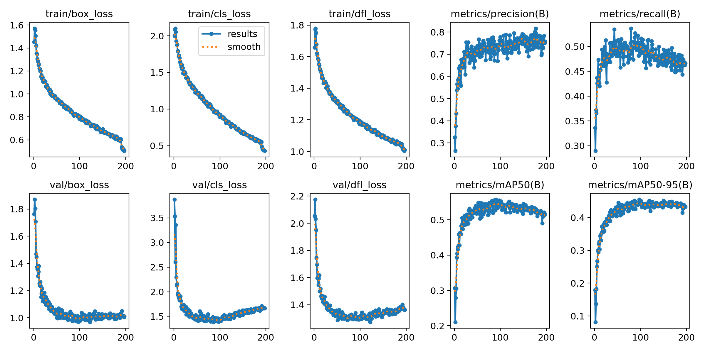
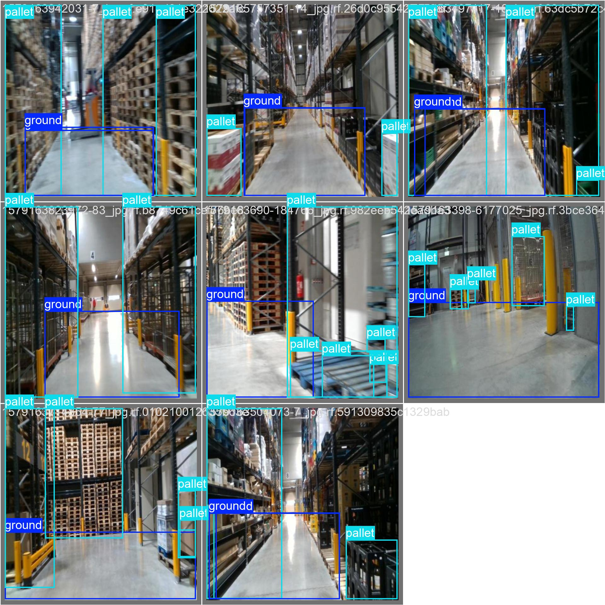
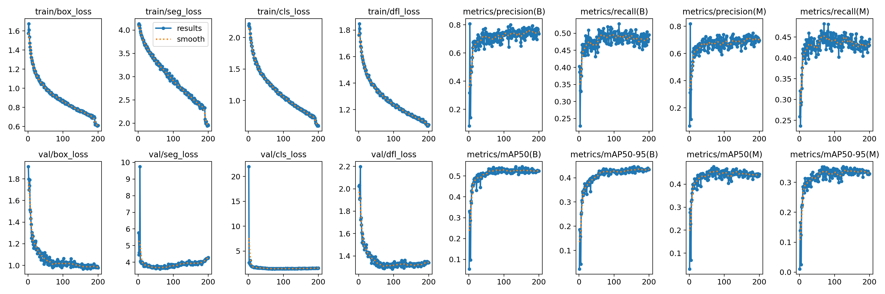
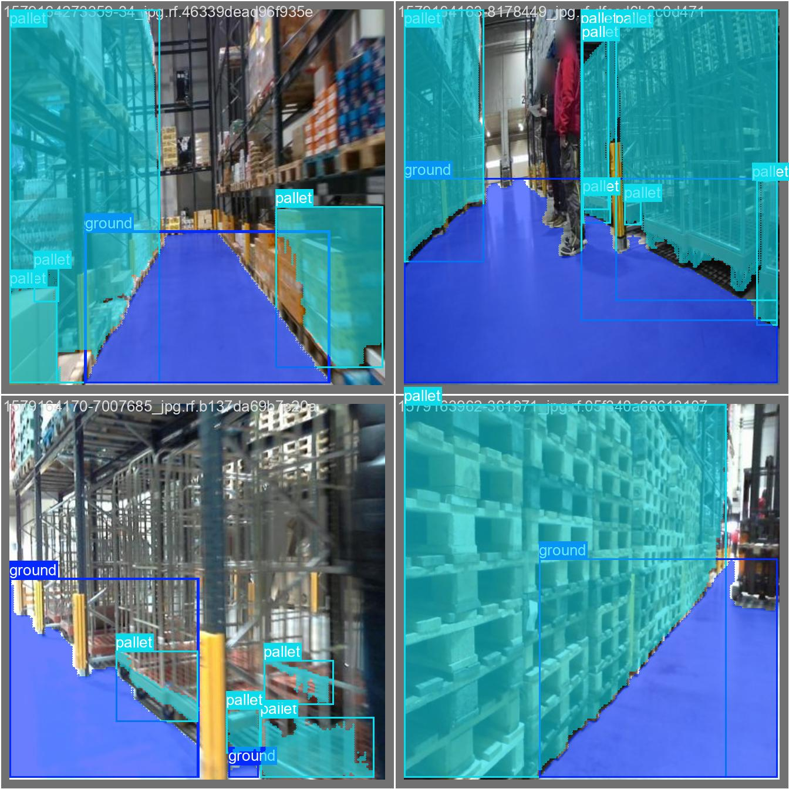

# Warehouse Pallet Detection and Ground Segmentation

This project implements computer vision capabilities for warehouse automation using YOLO models for pallet detection and ground segmentation. It's designed as a ROS2 Python node to run inference on trained models.

## Project Structure

- `pallet_inference_node.py`: Main ROS2 node for real-time detection and segmentation
- `test_yolo.py`: Script for testing the YOLO detection model
- `test_yolo_seg.py`: Script for testing the YOLO segmentation model
- `train_yolo.py`: Script for training the YOLO detection model
- `train_yolo_seg.py`: Script for training the YOLO segmentation model
- `onnx_transform.py`: Script for optimizing and converting models to ONNX format
- `trained_models/`: Directory containing both unoptimized and optimized models
  - `unoptimized/`: Contains the original PyTorch models
    - `detect/`: Detection model files
    - `segment/`: Segmentation model files
  - `optimized/`: Contains ONNX optimized models for faster inference

## Dataset and Pretrained YoloV11 models

I used Grounding DINO and Segment Anything in order to auto-label the pallets and the ground. Later I applied augmentation to expand the dataset, creating three augmented versions for each input example. These versions were generated by randomly applying transformations including horizontal/vertical flips, 90° rotations (clockwise, counter-clockwise, upside down), shearing up to ±10 degrees horizontally or vertically, and adjusting saturation and exposure within ±25% and ±10% respectively.
You can access the annotated and augmented dataset [here](https://drive.google.com/drive/folders/1Tl26XptJSrSrRZKV9seUjGnCajvc3N_1?usp=sharing).

For the project, YOLOv11 (object detection) and YOLOv11-seg (semantic segmentation) were chosen due to their optimal efficiency-accuracy balance. Using the Ultralytics framework, both were trained for 250 epochs (batch size 2) starting from YOLOv11-large pre-trained weights. This large variant was selected for its superior accuracy over smaller models and its compatibility with GPU-accelerated edge hardware. You can access the model weights [here](https://drive.google.com/drive/folders/136DmoP8DwPpPJM7DRR_V11IVhF94u9yk?usp=sharing).

## Setup and Installation

1. Clone this repository:
   ```bash
   git clone https://github.com/MayankD409/Warehouse_pallet_detection_Segmentation.git
   cd Warehouse_pallet_detection_Segmentation
   ```

2. Download the trained models:
   
   Due to size limitations on GitHub, the trained models are hosted on Google Drive. Download them from:
   [https://drive.google.com/drive/folders/1Bp9AkuBKCHDWW3z7k4iamuitBH6I3whi](https://drive.google.com/drive/folders/1Bp9AkuBKCHDWW3z7k4iamuitBH6I3whi?usp=sharing)

   After downloading:
   ```bash
   # Extract the downloaded zip file (if zipped)
   unzip trained_models.zip  # Adjust filename if different
   
   # Make sure the extracted folder is named 'trained_models' and place it in the project root
   # The structure should look like:
   # ├── trained_models/
   # │   ├── optimized/       # Contains ONNX optimized models
   # │   └── unoptimized/     # Contains original PyTorch models
   ```

3. Install the required dependencies:
   ```bash
   pip3 install -r requirements.txt
   ```

4. Source your ROS2 installation:
   ```bash
   source /opt/ros/humble/setup.bash  # Adjust based on your ROS2 version
   ```

## Usage

### Running the ROS2 Node

```bash
python3 pallet_inference_node.py
```

You can adjust the node parameters by modifying the script directly or by using ROS2 parameters when launching the node:

```bash
python3 pallet_inference_node.py --ros-args -p detection_model_path:=trained_models/unoptimized/detect/best.pt -p segmentation_model_path:=trained_models/unoptimized/segment/best.pt
```

### Using ONNX Optimized Models

For faster inference, you can use the optimized ONNX models:

```bash
python3 pallet_inference_node.py --ros-args -p use_onnx:=true -p onnx_detection_model_path:=trained_models/optimized/best_detect_fp16.onnx -p onnx_segmentation_model_path:=trained_models/optimized/best_segment_fp16.onnx
```

### Testing the Models

To test the detection model:
```bash
python3 test_yolo.py
```

To test the segmentation model:
```bash
python3 test_yolo_seg.py
```

### Model Optimization

To optimize your models and convert them to ONNX format:

```bash
python3 onnx_transform.py --detection_model trained_models/unoptimized/detect/best.pt --segmentation_model trained_models/unoptimized/segment/best.pt --output_dir trained_models/optimized
```

Add the `--quantize` flag to apply INT8 quantization for even faster inference (with some potential accuracy loss):

```bash
python3 onnx_transform.py --detection_model trained_models/unoptimized/detect/best.pt --segmentation_model trained_models/unoptimized/segment/best.pt --output_dir trained_models/optimized --quantize
```

## Parameters

The ROS2 node supports the following parameters:

- `detection_model_path`: Path to the YOLO detection model (default: `trained_models/unoptimized/detect/best.pt`)
- `segmentation_model_path`: Path to the YOLO segmentation model (default: `trained_models/unoptimized/segment/best.pt`)
- `use_onnx`: Whether to use ONNX models for inference (default: `false`)
- `onnx_detection_model_path`: Path to the ONNX detection model (default: `trained_models/optimized/best_detect_fp16.onnx`)
- `onnx_segmentation_model_path`: Path to the ONNX segmentation model (default: `trained_models/optimized/best_segment_fp16.onnx`)
- `confidence_threshold`: Confidence threshold for detection (default: 0.5)
- `segmentation_confidence_threshold`: Confidence threshold for segmentation (default: 0.35)
- `input_image_topic`: Input camera topic
- `output_detection_topic`: Output topic for detection results
- `output_segmentation_topic`: Output topic for segmentation results

## Testing with ROS2 Bag Files

If you have recorded ROS2 bag files with camera data, you can use them to test the pallet_inference_node.py. This allows you to replay real-world or simulated data without needing an actual camera.

### Playing a ROS2 Bag File

1. First, make sure your node is running in a separate terminal:

```bash
python3 pallet_inference_node.py
```

2. In a new terminal, play your bag file:

```bash
ros2 bag play /path/to/your/bagfile --loop  # --loop is optional for continuous replay
```

If your bag file has a different topic name than the one expected by the node (`/robot1/zed2i/left/image_rect_color`), you can remap it:

```bash
ros2 bag play /path/to/your/bagfile --remap /bag_camera_topic:=/robot1/zed2i/left/image_rect_color
```

### Visualizing the Results

You can visualize the detection and segmentation results using rqt_image_view:

```bash
ros2 run rqt_image_view rqt_image_view
```

Then from the dropdown menu at the top, select either:
- `/pallet_detection` - To view the detection results
- `/ground_segmentation` - To view the segmentation results

## Docker Usage

Before building the Docker image, make sure you've downloaded the trained models from Google Drive as described in the setup instructions.

Build the Docker image:

```bash
# Make sure the 'trained_models' directory is in the same location as the Dockerfile
docker build -t pallet_detection .
```

Run the container:

```bash
docker run --rm -it --gpus all pallet_detection
```

When the container starts, you'll be prompted to choose which model type to run:
1. Unoptimized PyTorch models (default)
2. Optimized ONNX models

To run with a specific model type without the interactive prompt, you can override the CMD:

```bash
# To run with unoptimized PyTorch models
docker run --rm --gpus all pallet_detection python3 /app/pallet_inference_node.py

# To run with optimized ONNX models
docker run --rm --gpus all pallet_detection python3 /app/pallet_inference_node.py --ros-args -p use_onnx:=true
```

## Troubleshooting 

If you encounter issues with the trained models:

1. Verify that the `trained_models` directory structure is correct:
   ```
   trained_models/
   ├── optimized/
   │   ├── best_detect_fp16.onnx
   │   └── best_segment_fp16.onnx
   │   └── ... (other optimized models)
   └── unoptimized/
       ├── detect/
       │   └── best.pt
       └── segment/
           └── best.pt
   ```

2. If the model files have different names than those referenced in code:
   - Update the paths in the command line arguments when running the node:
     ```bash
     python3 pallet_inference_node.py --ros-args -p detection_model_path:=trained_models/unoptimized/detect/YOUR_MODEL_FILENAME.pt
     ```
   - Or rename your files to match the expected naming convention.

3. For ONNX model problems:
   - You can regenerate optimized ONNX models using the `onnx_transform.py` script if needed.
   - Make sure you have the correct ONNX dependencies installed.

## Training Results

### Object Detection Training

The object detection model was trained using YOLOv11 to detect pallets in warehouse environments. Below are the training results:



#### Detection Model Performance
- Example 1:
  

### Segmentation Training

The segmentation model was trained to identify pallets and ground at the pixel level.



#### Segmentation Model Performance
- Example 1:
  